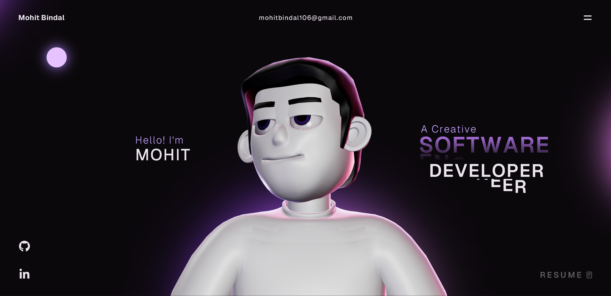

# Mohit's Developer Portfolio 🚀



Welcome to the repository for my personal developer portfolio! This is a high-performance web application designed to showcase my skills, open-source projects, and journey as a software engineer.

## 🌟 Overview

I built this platform to serve as a centralized hub for my work, including major projects like the **University Placement System**, **SecureShare**, and **HRMS Lite**. The design and architecture prioritize clean code, modern web technologies, and an exceptional end-user experience. Everything in this repository was custom-tailored by me to reflect my personal development journey.

## 🚀 Tech Stack

- **Frontend Framework:** React, Vite
- **Language:** TypeScript, JavaScript
- **Styling:** Modern CSS3, Flexbox/Grid, Custom CSS properties
- **Animations:** Custom GSAP implementation
- **Deployment:** Vercel

## 🛠️ Running Locally

1. **Clone the repository:**
   ```bash
   git clone https://github.com/Mohit-cmd-jpg/Developer-s-portfolio.git
   cd Developer-s-portfolio
   ```

2. **Install dependencies:**
   ```bash
   npm install
   ```

3. **Start the development server:**
   ```bash
   npm run dev
   ```

4. **Build for production:**
   ```bash
   npm run build
   ```

## 📬 Contact

Feel free to explore my source code or reach out to me via my [GitHub Profile](https://github.com/Mohit-cmd-jpg).
